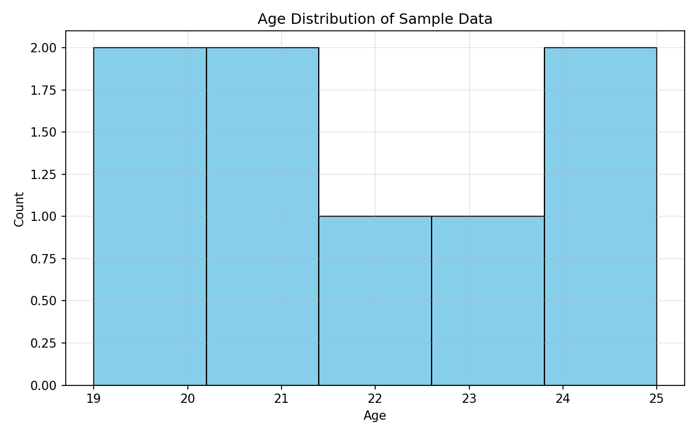

# SCT_DS_1
# SCT_DS_1 — Task 1: Data Distribution Visualization

This task visualizes the distribution of a sample dataset using a histogram and a bar chart.

### Steps performed
1. Loaded `sample.csv` using pandas.
2. Created a histogram of Age.
3. Created a bar chart of Gender.
4. Saved figures to `outputs/figures/`.

### Tools
- Python
- Pandas
- Matplotlib

### Output Samples

## Task 2 — EDA & Cleaning on Titanic Dataset

### Objective
Perform exploratory data analysis (EDA) and data cleaning on the Titanic dataset.

### Steps
1. Loaded dataset using Seaborn  
2. Checked data types, shape, and missing values  
3. Cleaned data by filling and dropping missing values  
4. Created visualizations for:
   - Age distribution  
   - Survival by gender  
   - Survival by passenger class  
5. Saved cleaned dataset and figures

### Output Files
- `data/titanic_cleaned.csv`
- `outputs/figures/task02_age_distribution.png`
- `outputs/figures/task02_survival_gender.png`
- `outputs/figures/task02_class_survival.png`
